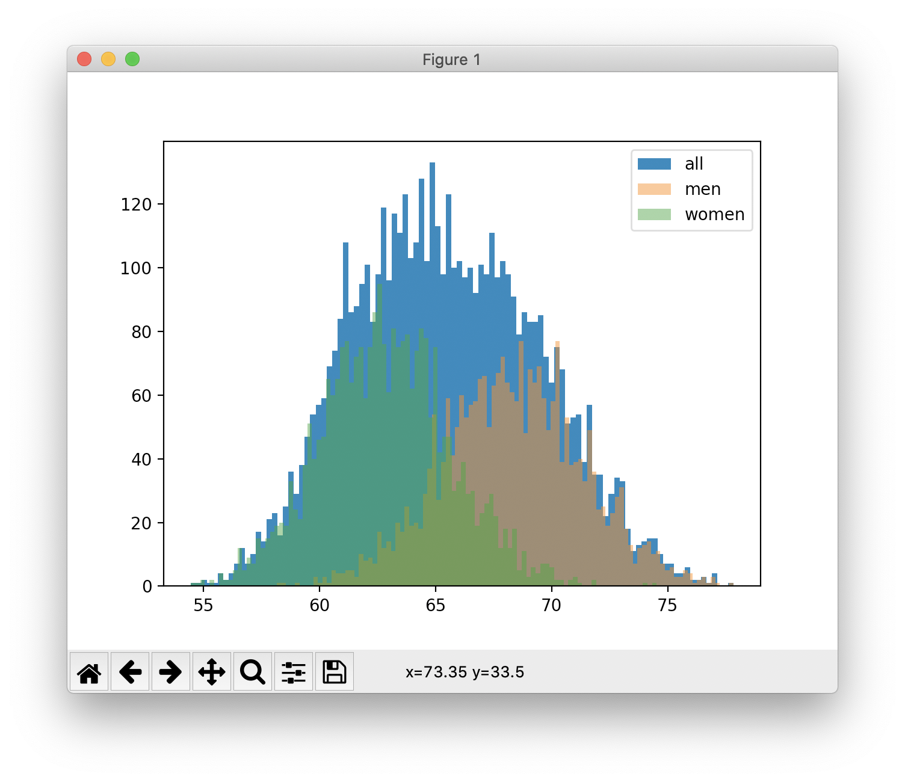

# Plot Human Height Histogram

Using data from the [2017-2018 National Health and Nutrition Examination
Survey](https://wwwn.cdc.gov/nchs/nhanes/search/datapage.aspx?Component=Examination&CycleBeginYear=2017),
generate a histogram of human adult (age > 18) height.

Paste this into your terminal:
```
python3 plot.py
```

You'll see this:


